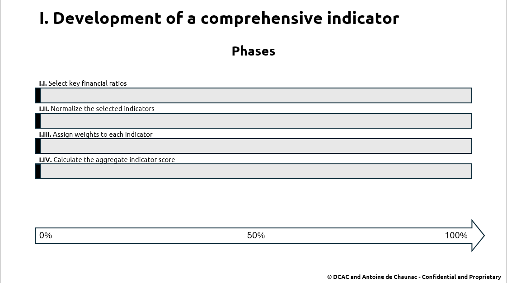
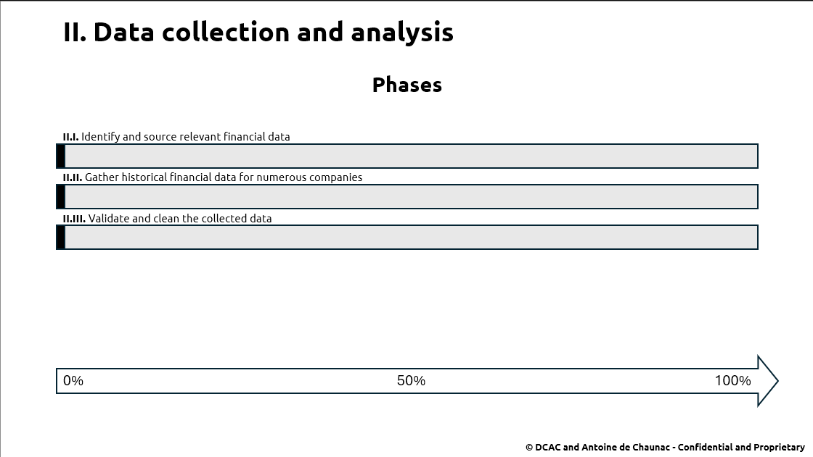
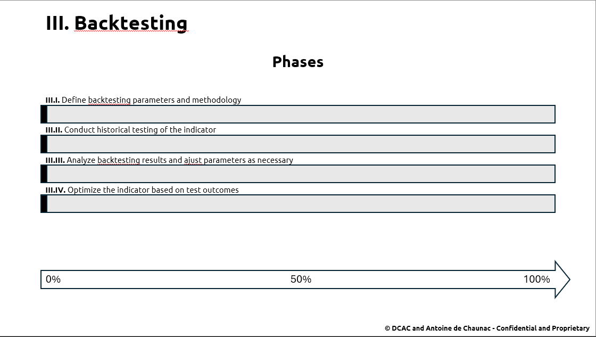
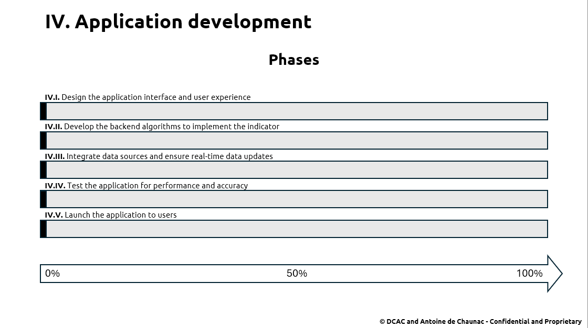
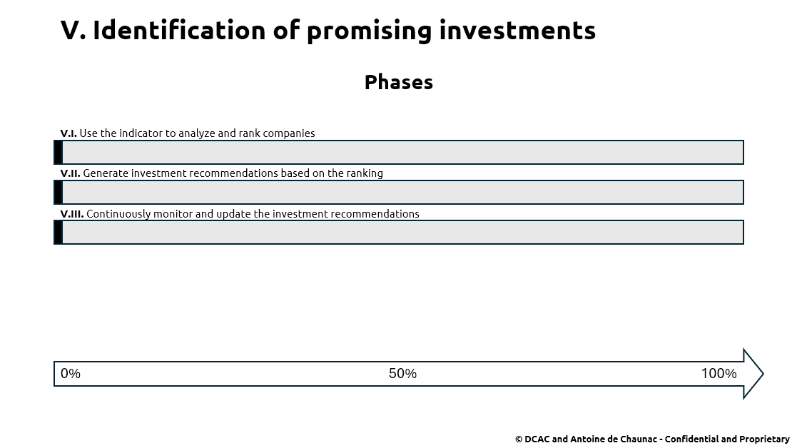
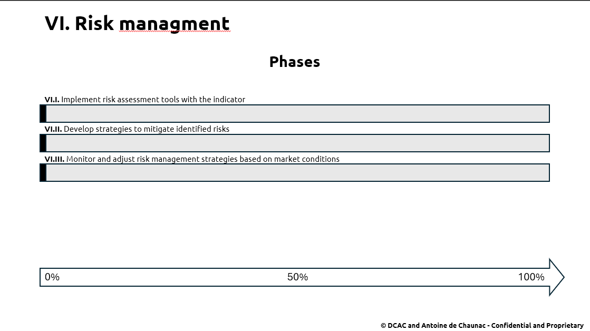
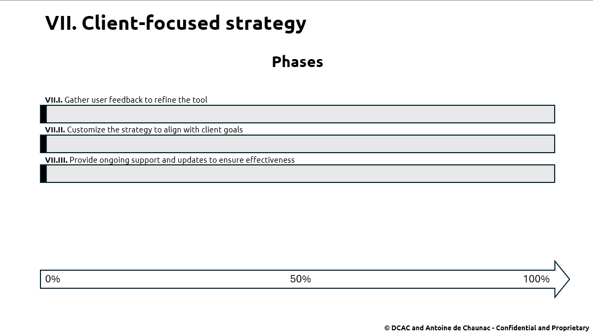

# Owl-Insight-Growth
# Create an innovative investment analysis tool combining multiple approaches to identify opportunities.

Owl Insight Growth is an innovative financial project that uses microeconomic, fundamental, and quantitative approaches to identify investment opportunities. It provides investors with a robust tool combining advanced financial analysis to maximize returns, offering an effective strategy based on solid data and rigorous methodology. The project focuses on developing a comprehensive financial indicator, supported by extensive data collection, thorough backtesting, and the development of a user-friendly application. Our ultimate goal is to deliver a reliable and powerful investment tool that adapts to market changes, ensuring sustained success and value for investors over the long term.

This project will provide :
- A Detailed Financial Indicator
- A Robust Dataset of Historical Financial Information
- A Validated and Optimized Indicator
- A User-Friendly Application for Investment Analysis
- A Comprehensive Risk Management Plan
- Ongoing Client Support and Strategy Customization

These deliverables collectively ensure the Owl Insight Growth project provides a powerful, reliable, and adaptable investment tool designed to maximize returns and minimize risks for investors.

## Summary
- [Key objectives](#key-objectives)
- [Deliverables](#deliverables)
- [Resource plan](#resource-plan)
- [Documentation](#documentation)
- [Roadmap](#roadmap)

## Key objectives

This section outlines the main objectives of the project:

- Development of a comprehensive indicator:  
Create an aggregate financial indicator using key financial ratios. This indicator will serve as a cornerstone for evaluating and ranking investment opportunities, providing a clear and precise metric for assessing the financial health and growth potential of companies.

- Data collection and analysis:  
Conduct extensive financial data collection from a wide range of companies, sourcing, gathering, and consolidating historical financial data to build a robust dataset. Thorough analysis will be performed to validate the accuracy and relevance of the data, ensuring that the analysis is based on accurate and comprehensive information.

- Backtesting:  
Validate the effectiveness of the financial indicator through historical testing by applying the indicator to past data to assess its predictive power and reliability. This process helps in optimizing the indicator's parameters, ensuring its accuracy and effectiveness in real-world scenarios.

- Application development:  
Build a dedicated application to implement the financial indicator, featuring an intuitive user interface and backend algorithms to calculate the indicator scores. This application will enable users to efficiently analyze investment opportunities using the comprehensive financial indicator.

- Identification of promising investments:  
Utilize the financial indicator to identify and rank the most promising investment opportunities, generating a ranked list of potential investments. This objective focuses on leveraging the indicator to make informed investment decisions, aiming to maximize returns and minimize risks.

- Risk management:  
Implement risk assessment tools and strategies within the financial indicator and the application, identifying potential investment risks, evaluating their impact, and developing mitigation strategies. This ensures the protection of client investments by proactively managing risks and minimizing potential losses.

- Client-focused strategy:  
Ensure that the investment tool offers a robust and effective strategy tailored to meet the specific needs and goals of clients by providing personalized investment recommendations and ongoing support. This client-focused approach enhances satisfaction and helps build long-term relationships with clients.

## Deliverables

In this section, you will find the project deliverables:

- A detailed financial indicator:   
An advanced indicator incorporating key financial ratios to evaluate and rank companies.

- A robust dataset of historical financial information:  
Extensive and validated financial data from numerous companies.

- A validated and optimized indicator:  
A thoroughly tested and optimized indicator based on historical backtesting.

- A user-Friendly application for investment analysis:  
An intuitive application designed for ease of use, enabling efficient analysis of investment opportunities.

- A comprehensive risk management plan:  
Detailed risk management strategies integrated within the indicator and application.

- Ongoing client support and strategy customization:  
Continuous support and personalized strategy customization to meet client goals, with regular updates based on feedback and market trends.

## Resource plan

In progress

## Documentation

In this section you will find the documentation you need to better understand the project:

[Executive summary](documentation/executive_summary.pdf): A concise overview of the project.

[Project overview](documentation/overview.pdf): Detailed description of project goals, phases, and expected outcomes.

[Roadmap](documentation/roadmap/roadmap.pdf): Timeline and milestones for project development.

## Roadmap

Here's the project roadmap to help you keep track of progress: 

Phase 1:

Phase 2:

Phase 3:

Phase 4:

Phase 5:

Phase 6:

Phase 7:

